# IRR-PINN: Physics-Informed Neural Networks with Irreversibility Constraints


## Overview

This repository implements the IRR-PINN (Irreversibility-constrained Physics-Informed Neural Networks) framework, a novel approach specifically designed to address physics problems involving irreversible processes. 

The key innovation of IRR-PINN lies in the introduction of **irreversibility constraints** as additional regularization terms in the loss function. This constraint mechanism effectively reduces the solution space and guides the neural network toward physically meaningful solutions.

### Irreversibility Constraint Formulation

For **forward irreversible processes** (where the physical quantity should only increase):
```python
loss_irr = mean(ReLU(-dphi/dt))
```
For **backward irreversible processes** (where the physical quantity should only decrease):
```python
loss_irr = mean(ReLU(dphi/dt))
```
where:
- `dphi/dt` represents the time derivative of the physical quantity $\phi$
- `ReLU` activation function ensures that only violations of the irreversibility constraint contribute to the loss
- The constraint can be generalized to any inequality-based governing equations
This simple yet powerful formulation significantly improves solution accuracy and stability for irreversible physical processes by enforcing the fundamental directionality constraints inherent in these systems.

## Examples

We demonstrate the effectiveness of the IRR-PINN framework through four challenging applications: corrosion modeling, ice melting simulation, fracture mechanics, and combustion dynamics. Each example showcases how irreversibility constraints lead to more physically consistent and accurate solutions compared to traditional PINN approaches.

### Corrosion

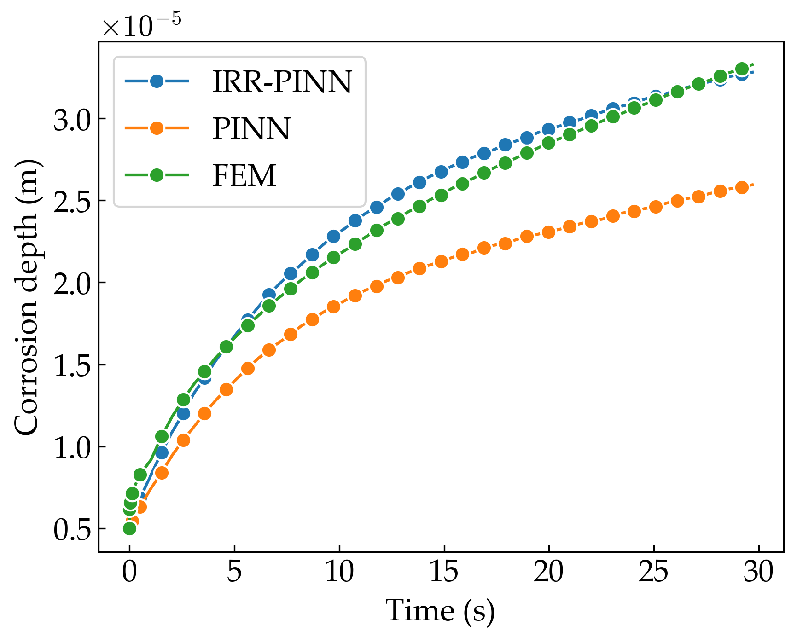
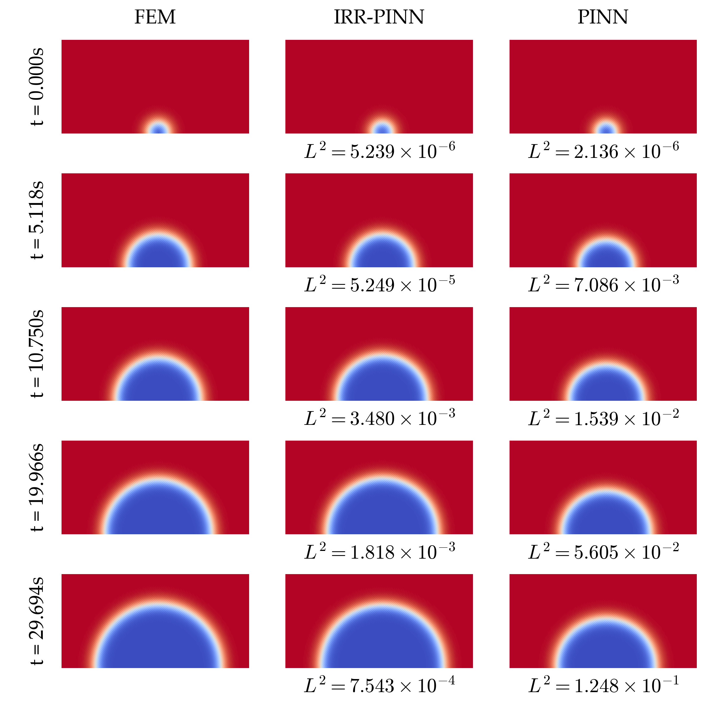
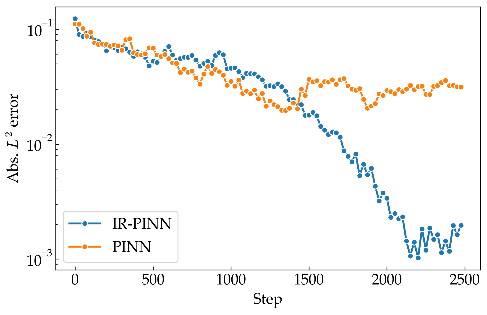
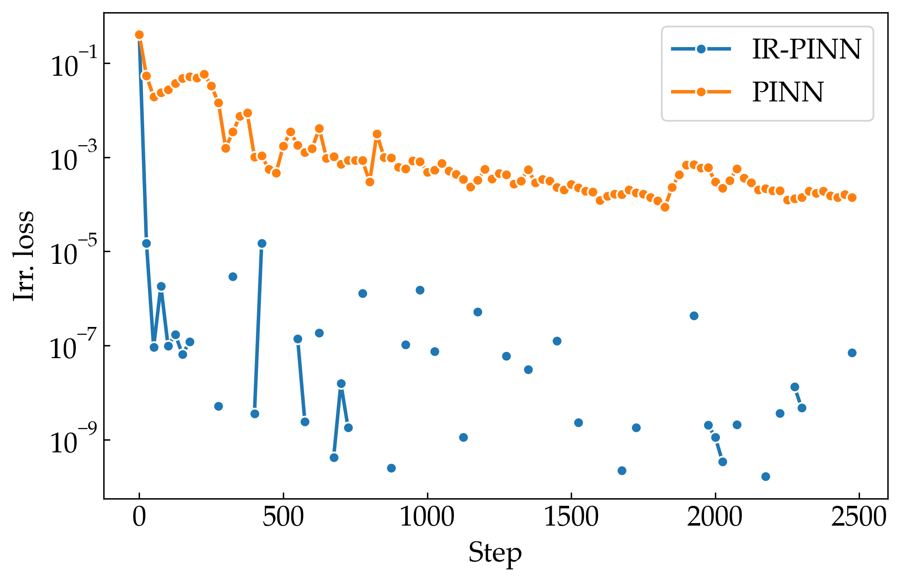

### Ice melting

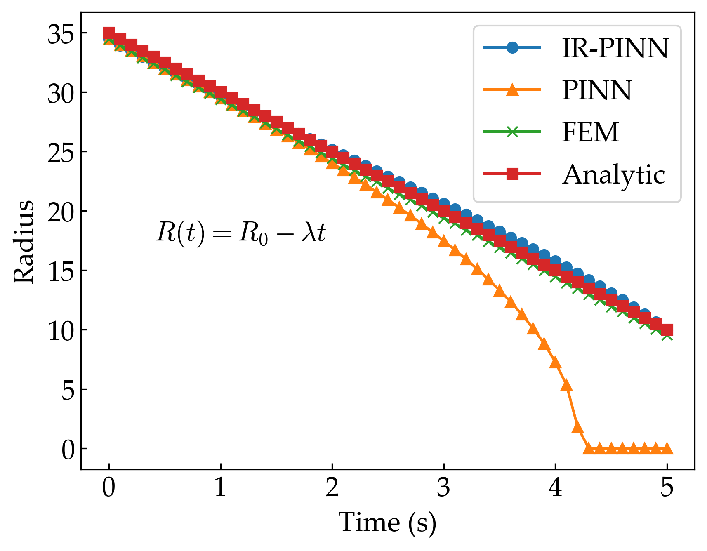
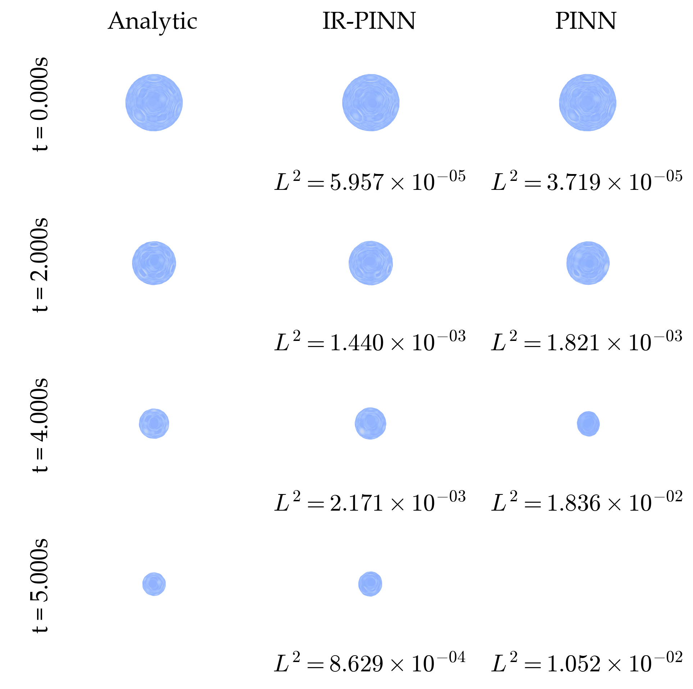
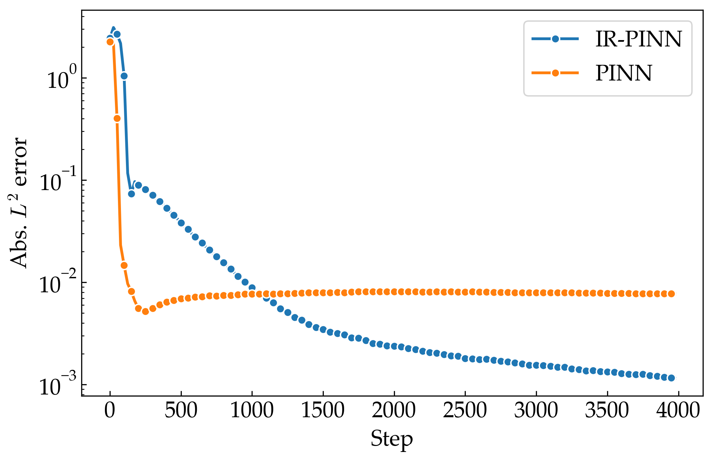


### Fracture

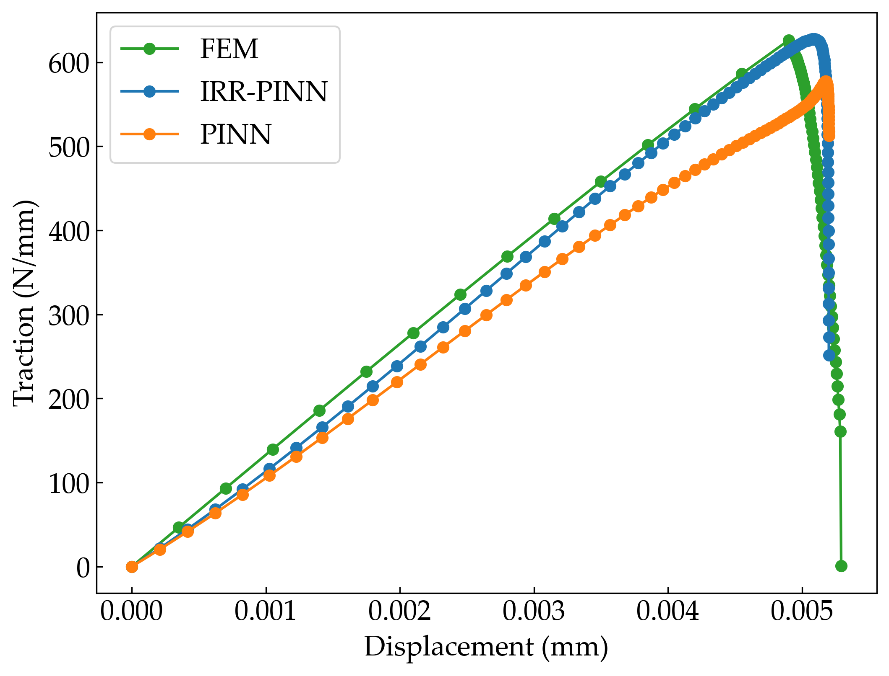
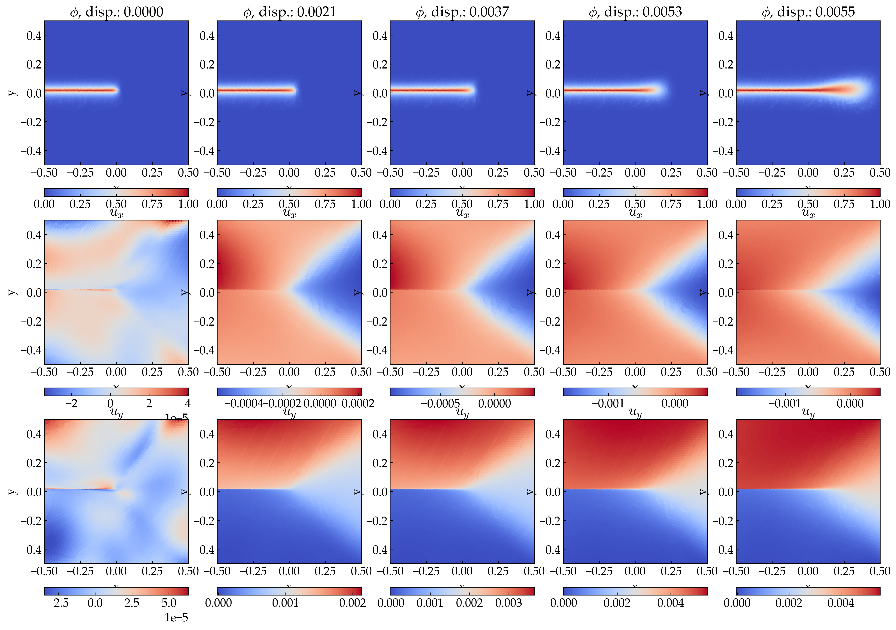

### Combustion

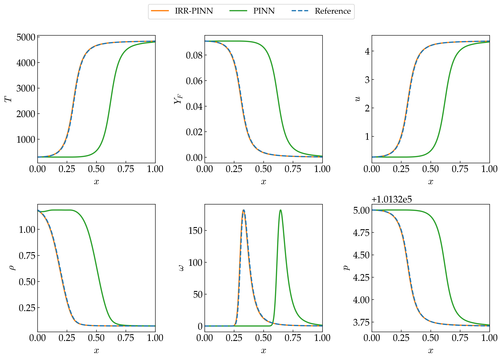
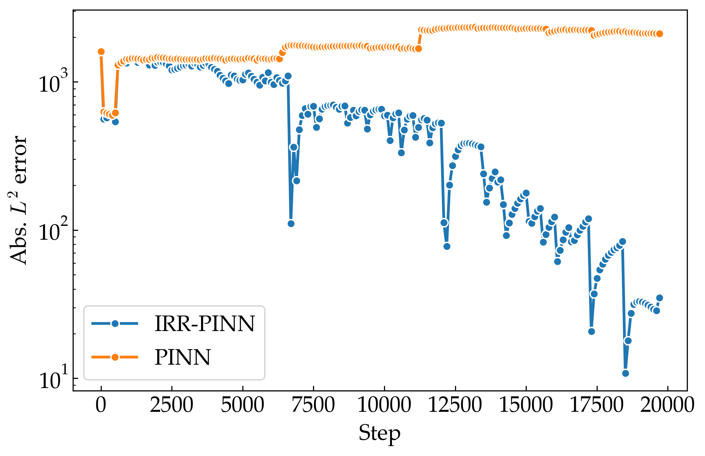
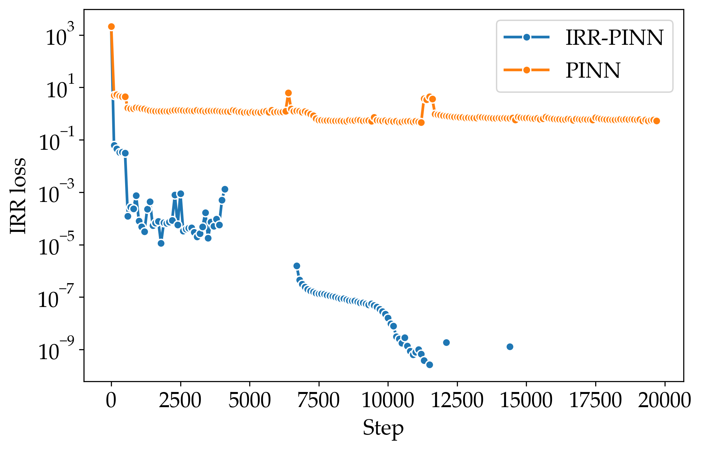